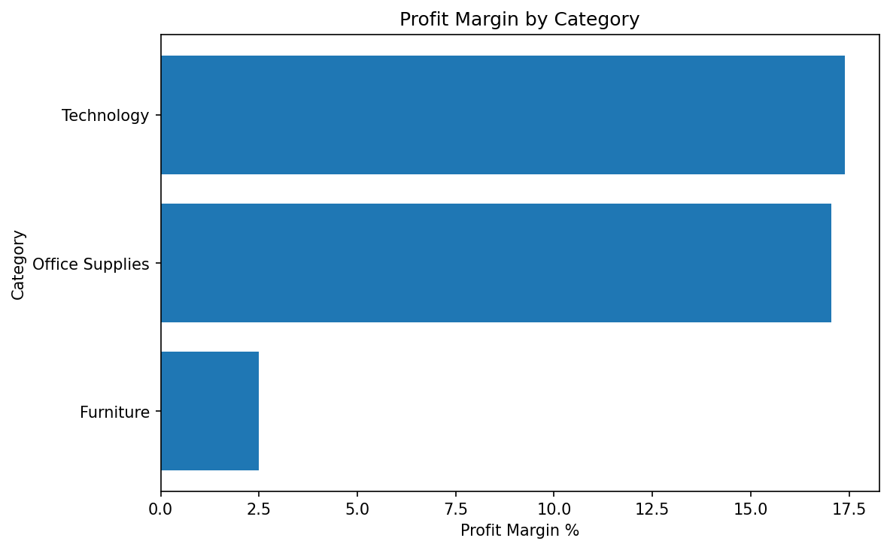
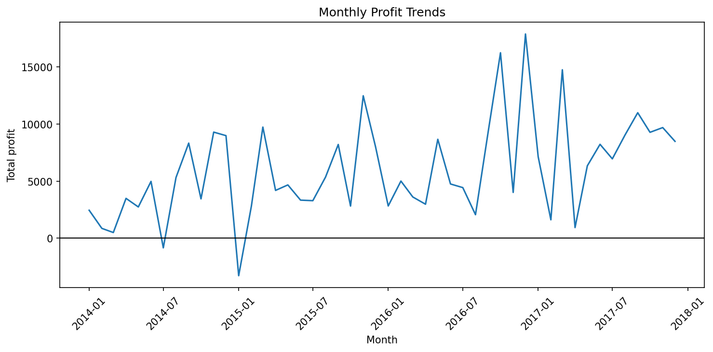
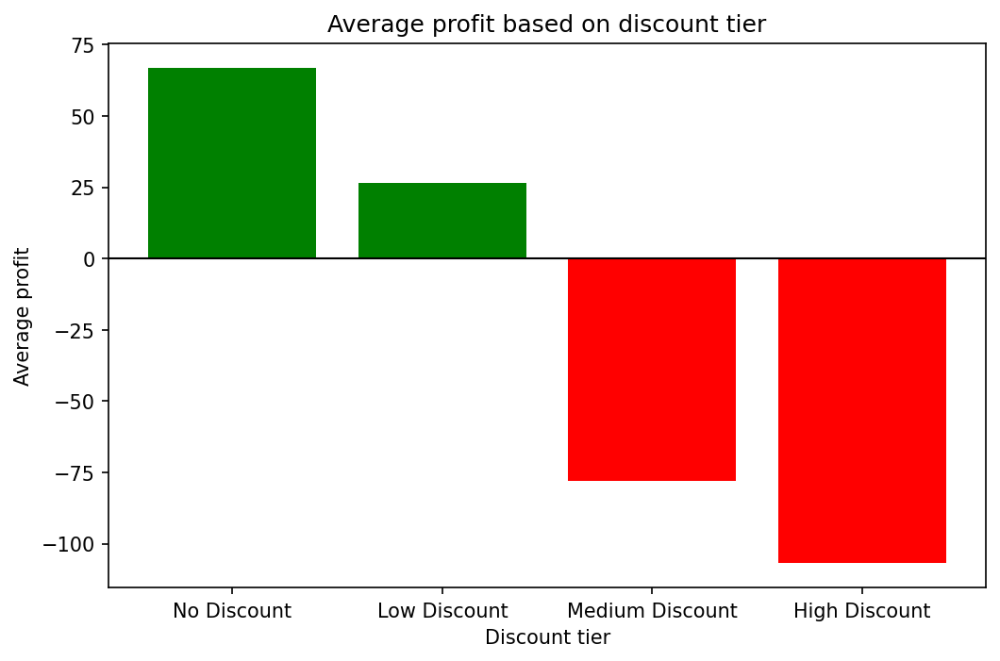
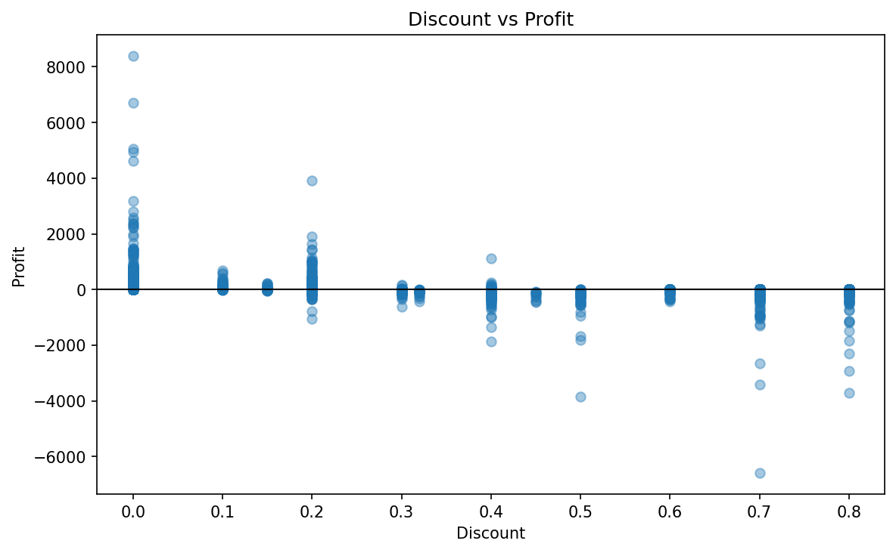

# Retail Performance Analysis - Superstore Dataset 

An end to end analysis identifying profit drivers, loss-making segments, and discount impact across a US retail business using SQL, Python and Power BI. 

## Project Overview 

This project analyses 9,994 retail transactions across four US regions to identify why certain categories, products, and customer segments generate losses despite healthy revenue. The analysis reveals that Furniture's 2.5% profit margin, seven loss making sub-categories in the Central region, and a $135,000 profit loss from high discount orders are the primary drivers for under performance. Findings were developed in SQL, independently verified in python and visualised in Power BI. 

## Tool used 

* SQL — 7 business queries covering category performance, regional breakdown, discount analysis, customer segmentation, and product ranking
* Python — Pandas EDA with cross-validation against SQL results, Matplotlib visualisations, and correlation analysis
* Power BI — interactive dashboard (in progress)

## Key Findings

### 1. Central region had healthy sales but weak profitability. 

The West region was the strongest overall, generating $725,457.82 in sales, $108,418.45 in profit, and a 14.94% profit margin.

Central generated $501,239.89 in sales, which was higher than South’s $391,721.91. However, Central’s profit margin was only 7.92%, compared with South’s 11.93%.

This suggests Central has healthy revenue but weaker profitability.

### 2. Central weak profit was caused by multiple loss-making sub-categories

Further analysis showed that 7 out of 17 Central sub-categories produced negative profit.

The weakest sub-category was Furnishings, which generated $15,254.37 in sales but lost $3,906.22, resulting in a -25.61% profit margin.

This means Central’s weak performance is not caused by one isolated product area. Multiple sub-categories should be reviewed for discounting, product cost, pricing, or operational issues.

### 3. High discounts had a severe impact on profit

Orders with no discount were the most profitable, generating $320,987.60 in total profit with an average profit of $66.90 per row.

High-discount orders produced the largest total loss at -$99,558.59, with an average loss of -$106.71 per row.

Python also showed a -0.219 correlation between discount and profit. This is a weak negative relationship, meaning higher discounts are linked to lower profit, but discount is not the only factor affecting profitability.

The more important finding is that medium and high discount orders generated almost $135,000 in total losses. This suggests the discount issue is concentrated in heavily discounted orders rather than spread evenly across all transactions.

### 4. High-revenue customers were not always high-value customers

Sean Miller was the customer that brought in the highest revenue, generating $25,043.05 in revenue across 5 orders. However, this customer recorded a negative profit of -$1,980.74.

Tamara Chand generated slightly lower revenue at $19,052.22, also across 5 orders, but produced $8,981.32 in profit.

This shows that customer value should be measured using both revenue and profit, not just revenue alone. 

## Visualisations

### Category Profit Margin

### Monthly Profit Trend

### Discount Tier Profit

### Discount vs Profit Scatter Plot

